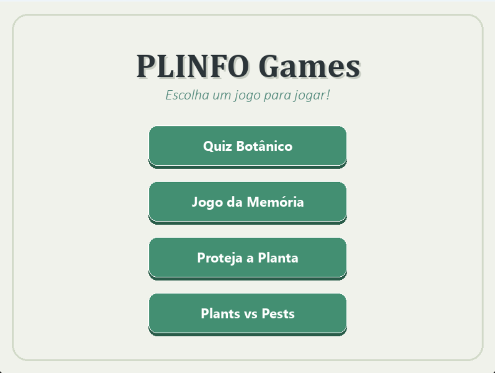
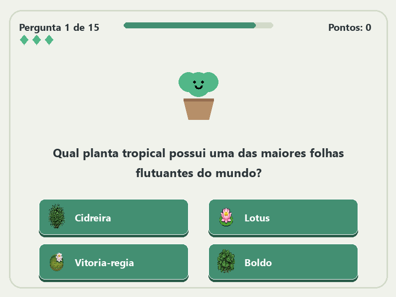
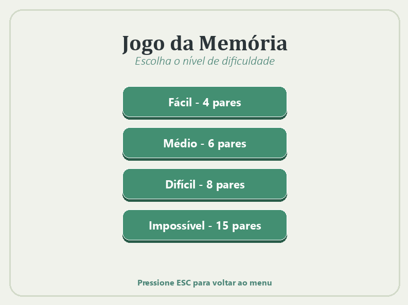
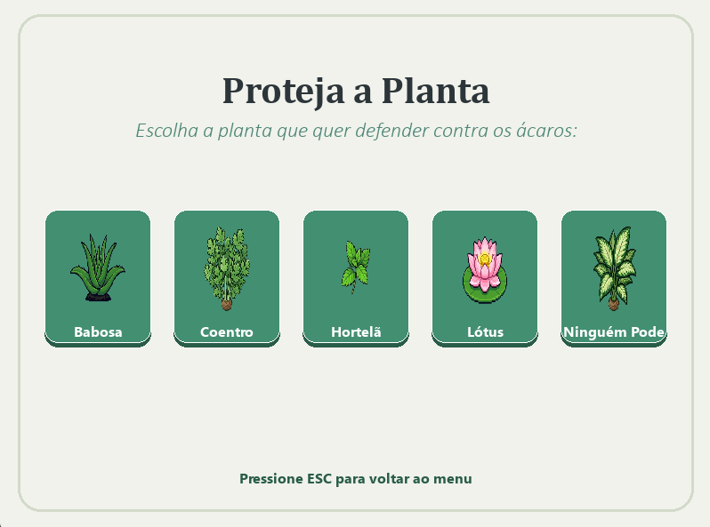
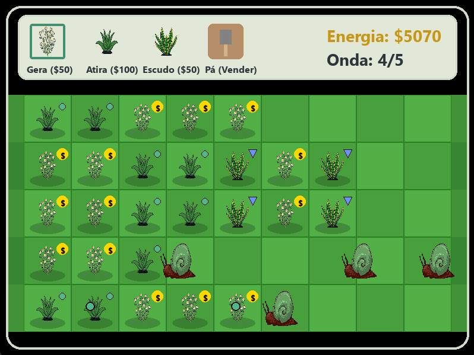

# PLINFO Games — Jogos Botânicos

Projeto educacional desenvolvido em **Python** com **Pygame**, composto por minigames com temática de plantas, botânica e proteção contra pragas.

O objetivo do projeto é tornar o aprendizado sobre plantas mais interativo, usando mecânicas simples de quiz, memória, seleção visual, defesa por clique e defesa em grade inspirada em jogos de estratégia.

## Objetivo

O **PLINFO Games** busca auxiliar o aprendizado de conceitos básicos sobre plantas medicinais, ornamentais, culinárias e suas características por meio de jogos digitais.

O projeto pode ser usado em apresentações escolares, feiras de conhecimento, atividades de extensão, disciplinas introdutórias de programação ou ações educativas sobre botânica.

## Funcionalidades

- Menu principal com acesso aos minigames.
- Quiz botânico com perguntas, alternativas, pontuação, vidas e tempo limite.
- Jogo da memória com diferentes níveis de dificuldade.
- Minigame de proteção da planta contra pragas por clique.
- Minigame de defesa em grade com plantas, energia, projéteis, ondas de inimigos e chefe final.
- Uso de imagens reais/temáticas de plantas e pragas.
- Interface gráfica feita com Pygame.

## Minigames disponíveis

### 1. Quiz Botânico

Arquivo principal: `jogo_planta.py/jogo_planta.py`

Neste modo, o jogador responde perguntas sobre plantas. Cada pergunta possui quatro alternativas e pode exibir imagens correspondentes às opções.

Principais características:

- perguntas aleatórias;
- tempo limite por pergunta;
- sistema de vidas;
- pontuação;
- feedback visual de resposta correta ou errada;
- mascote botânico na interface.

### 2. Jogo da Memória

Arquivo principal: `jogo_planta.py/jogo_memoria.py`

Neste modo, o jogador deve encontrar pares de cartas com imagens de plantas.

Principais características:

- escolha de dificuldade;
- cartas embaralhadas;
- contagem de movimentos;
- detecção automática de pares;
- tela de vitória ao encontrar todos os pares.

### 3. Proteja a Planta

Arquivo principal: `jogo_planta.py/jogo_defesa.py`

Neste modo, o jogador escolhe uma planta e precisa defendê-la de pragas que avançam em sua direção.

Principais características:

- seleção inicial da planta;
- inimigos surgindo pelas bordas da tela;
- eliminação de pragas com clique do mouse;
- barra de vida da planta;
- aumento progressivo de dificuldade;
- tela de fim de jogo.

### 4. Defenda a Torre

Arquivo principal: `jogo_planta.py/jogo_zombies.py`

Minigame de defesa em grade inspirado em jogos de estratégia. O jogador posiciona plantas para impedir o avanço das pragas.

Principais características:

- sistema de energia;
- plantas com funções diferentes;
- projéteis;
- ondas de inimigos;
- chefe final;
- opção de remover plantas com a pá;
- vitória ou derrota conforme o desempenho do jogador.

## Tecnologias utilizadas

- Python
- Pygame
- Módulos nativos do Python:
  - `random`
  - `time`
  - `math`
  - `os`

## Pré-requisitos

Antes de executar o projeto, é necessário ter instalado:

- Python 3.10 ou superior;
- Pygame.

## Instalação

Clone ou baixe este repositório.

Depois, instale a dependência principal:

```bash
pip install pygame
```

Em alguns ambientes, pode ser necessário usar:

```bash
python -m pip install pygame
```

ou, no Windows:

```bash
py -m pip install pygame
```

## Como executar

Execute o projeto a partir da pasta raiz, onde estão a pasta `imagens` e a pasta `jogo_planta.py`.

```bash
python jogo_planta.py/menu_jogo_.py
```

No Windows, caso o comando `python` não funcione, use:

```bash
py jogo_planta.py/menu_jogo_.py
```

Atenção: não execute o jogo de dentro da pasta `jogo_planta.py`, pois os caminhos das imagens foram configurados considerando a execução pela raiz do projeto.

## Estrutura do projeto

```text
.
├── imagens/
│   ├── acaro.png
│   ├── alecrim.png
│   ├── babosa.jpg
│   ├── boldo.png
│   ├── camomila_estacao_dos_graos.jpg
│   ├── cidreira.png
│   ├── coentro.png
│   ├── comigo_ninguem_pode.jpg
│   ├── espada_de_sao_jorge.jpg
│   ├── guaco.png
│   ├── hortela.jpg
│   ├── lotus.jpg
│   ├── louro.jpg
│   ├── mamona.jpg
│   ├── manjericao.png
│   ├── oregano.png
│   ├── praga1.png
│   ├── praga2.png
│   ├── praga3.png
│   ├── praga4.png
│   ├── salsa.png
│   ├── tomilho.png
│   └── vitoria_regia.jpg
│
├── jogo_planta.py/
│   ├── jogo_defesa.py
│   ├── jogo_memoria.py
│   ├── jogo_planta.py
│   ├── jogo_zombies.py
│   ├── menu_jogo_.py
│   └── perguntas_quiz.py
│
└── README.md
```

## Controles & Imagens do Projeto

### Menu Principal



- Clique com o mouse sobre o botão do jogo desejado.
- Feche a janela para encerrar o programa.

### Quiz Botânico



- Clique para iniciar.
- Clique na alternativa correta.
- Pressione `ESC` para voltar ao menu.

### Menu do Jogo da Memória



- Escolha o nível de dificuldade.
- Clique nas cartas para revelar os pares.
- Pressione `ESC` para voltar ao menu.

### Menu do Proteja a Planta



- Escolha uma planta.
- Clique nas pragas para eliminá-las antes que alcancem a planta.
- Pressione `ESC` para voltar ao menu.

### Plantas VS Pragas



- Clique em uma planta no menu superior.
- Clique em uma célula do grid para posicioná-la.
- Use a pá para remover plantas.
- Pressione `R` para reiniciar após vitória ou derrota.
- Pressione `ESC` para voltar ao menu.

## Autoria

- Renato Rodrigues Barbosa Filho
- Pedro Albuquerque de Coutinho